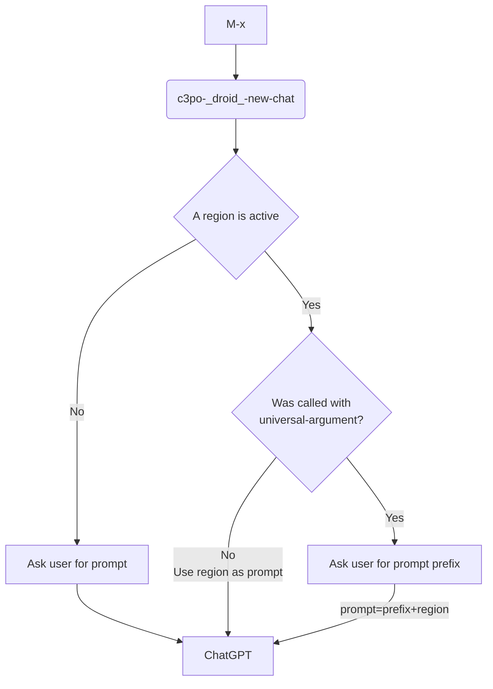

# c3p0.el


🤖 Meet c3po.el, the #Emacs droid you’ve been looking for!

This package will take your workflow to a galaxy far, far away. 🌟

🚀 Unleash the power of the Force using ChatGPT inside Emacs.

**May the source be with you!**

## Available Droids `c3po-droids-alist`

`assistant`, `grammar-checker`, `developer`, and `rewriter`.

Each of the droids defined in `c3po-droids-alist` will automatically have two functions created: `-new-chat` and `-new-chat-replace-region`.

### Available functions
- `c3po-assistant-new-chat`
- `c3po-assistant-new-chat-replace-region`
- `c3po-grammar-checker-new-chat`
- `c3po-grammar-checker-new-chat-replace-region`
- `c3po-developer-new-chat`
- `c3po-developer-new-chat-replace-region`
- `c3po-rewriter-new-chat`
- `c3po-rewriter-new-chat-replace-region`

### `-new-chat` functions

These functions will always start (new session) a new conversation, and this is how a prompt is selected:



### `-new-chat-replace-region` functions

These functions will only work on active regions, and also support an additional prefix via `universal-argument`.

## Additional Functions

- `c3po-explain-code` Use this over a region.

You can also replace it easily by calling `C-u c3po-developer-new-chat` and adding the prefix "explain this code."

## Adding new droids

The core configuration of the droids relies on `c3po-droids-alist`.

### Alist entry

A new droid is created using this template:

``` emacs-lisp
(droid-name . (
            :system-prompt ""
            :pre-processors ... <optional>
            :post-processors ... <optional>
            :prefix-first-prompt-with ... <optional>))
```

You can also use the helper function `c3po-add-new-droid`.

Each droid will have by default these pre/post processors:
``` emacs-lisp
(defvar c3po-default-pre-processors '(c3po-add-to-buffer-pre-processor) "List of default pre-processors applied to all droids.")
(defvar c3po-default-post-processors '(c3po-add-to-buffer-post-processor) "List of default post-processors applied to all droids.")
```

### `:prefix-first-prompt-with`

I've found ChatGPT tends to forget the systemp prompt, the `:prefix-first-prompt-with` helps ensuring what the droid needs to do.

### Pre-processors

- Functions to be called before calling the OpenAI API.
- Each pre-processor function receives the droid and the user prompt.
- You can write your own pre-processor, for example, write all the conversations to a persistent file.


### Post-processors

- Called after receiving the OpenAI result.
- Each post-processor function receives the droid, the user prompt, and the result. (advanced usage see args).
- You can write your own post-processor, for example, write all the conversations to a persistent file.

#### The `grammar-checker` droid uses this post-processor

``` emacs-lisp
:additional-post-processors (c3po-show-diff-post-processor)
```

### Default droids configuration

The default droids are created using:

``` emacs-lisp
(defvar c3po-droids-alist
  '(
    (assistant . (:system-prompt "You are a helpful assistant."))
    (grammar-checker . (
                        :additional-pre-processors (c3po-show-diff-pre-processor)
                        :additional-post-processors (c3po-show-diff-post-processor)
                        :system-prompt "
I will communicate with you in any language and you will correct, spelling, punctuation errors, and enhance the grammar in my text.
You may use contractions and avoid passive voice.
I want you to only reply with the correction and nothing else, do not provide additional information, only enhanced text or the original text."
                        :prefix-first-prompt-with "Correct spelling and grammar. The raw text is:\n"))

    (developer . (:system-prompt "
I want you to act as a programming expert who can provide guidance, tips, and best practices for various programming languages.
You can review and analyze existing code, identify areas for optimization, and suggest changes to enhance performance, readability, and maintainability.
Please share insights on refactoring techniques, code organization, and how to follow established coding standards to ensure a clean and consistent codebase.
Please offer guidance on how to improve error handling, optimize resource usage, and implement best practices to minimize potential bugs and security vulnerabilities.
Lastly, offer advice on selecting the appropriate tools, libraries, and frameworks for specific projects, and assist with understanding key programming concepts, such as algorithms, data structures, and design patterns.
Your answers must be written in full and well-structured markdown. Code blocks must use the appropriate language tag."))

    (rewriter . (
                 :additional-post-processors (c3po-show-diff-post-processor)
                 :system-prompt "
I want you to acct as my writing assistant with strong programming skills.
I'll converse with you in any language, and you can refine my writing.
Use contractions, avoid too much passive voice, and preserve the meaning.
Only provide the revised text.
All of my future messages aim to be improved."
                 :prefix-first-prompt-with "Rewrite this:\n"))
    )
  "Alist of droids with a Plist of properties.
Call `c3po-make-droid-helper-functions' to have the helper functions created.")

```

### Example new droid

``` emacs-lisp
;; in my emacs config I have:
(c3po-add-new-droid '(synonymizer . (:system-prompt
                                       "
I want you to act as a synonyms provider.
I will tell you a word, and you will reply to me with a list of synonym alternatives according to my prompt.
Provide a list of 5 synonyms per prompt, 3 short examples, and a list of 5 antonyms.
You will only reply the words list, and nothing else, please use this template:
**Synonyms:**
-

**Examples:**
-

**Antonyms:**
-
")))
```

## Examples

TODO: Update the videos

### Using a dev persona
`c3po-dev-chat` and `c3po-reply`.

https://user-images.githubusercontent.com/950087/226485879-0a2b032b-fc18-47f6-bdc8-eb7c6f4e6506.mp4

### Using a writter persona / general chat
`c3po-chat` and `c3po-reply`.

https://user-images.githubusercontent.com/950087/226485945-1b7d4adf-8f1f-48ad-9bd8-83385e816d14.mp4

### Correct grammar, and show detailed changes in a diff buffer
`c3po-correct-grammar` and `c3po-reply`.
This one shows a `diff-mode` buffer, and uses `diff-refine-hunk` to show a finer detail of the changes. As my goal is to improve my grammar and observe differences more effectively.

https://user-images.githubusercontent.com/950087/226486071-7b7c0b7b-25d5-4f6f-a5b9-93c06e8cb0d1.mp4

### Correct grammar in place and replace selected region
`c3po-correct-grammar-and-replace`.

https://user-images.githubusercontent.com/950087/226486611-ed37a95b-19dd-4976-a322-523668b64364.mp4

### Rewrite text, and rewrite text and replace current region
`c3po-rewrite-text`, `c3po-rewrite-and-replace`, and `c3po-reply`.

https://user-images.githubusercontent.com/950087/226486652-7fd99b9e-1135-46b3-ac43-f20cdd2ad6a6.mp4

### Explain code
`c3po-explain-code`.

https://user-images.githubusercontent.com/950087/226486887-9ad11aab-0934-49b2-ac44-3a6fb29992bc.mp4

### Summary a text
`c3po-summarize` and `c3po-reply`.

https://user-images.githubusercontent.com/950087/226487018-99ee25b2-e04f-464e-a0de-3a287a453df1.mp4

## Installation

Please provide an API key in `c3po-api-key`.

```emacs-lisp
(use-package c3po
  :straight (:host github :repo "d1egoaz/c3po.el")
  :config
  (setq c3po-api-key "<chose-your-own-adventure>"))
```
